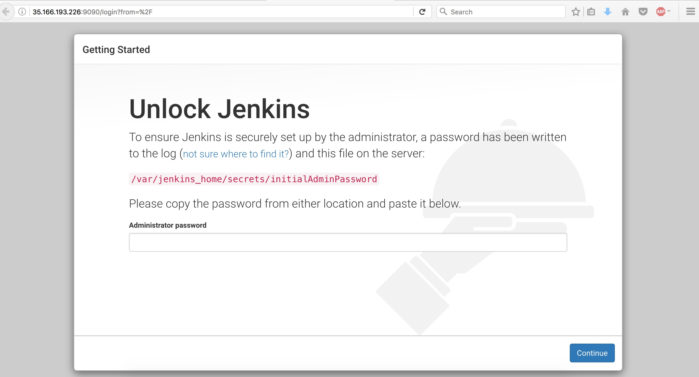

# Apresentando: Itamae


Itamae é um projeto open-source baseado no Chef, disponibilizado no Github: https://github.com/itamae-kitchen/itamae e que funciona apra gestão e configuração de ambientes (configuration management tool). É muito parecido com o Ansible, o Chef e o Puppet.

Eu fui apresentado a ele há mais ou menos um ano e com o tepmo pude perceber que é uma ferramenta poderosa se combinada à sua criatividade. Naquela época não tive muito interesse em usar, mas atualmente surgiu uma motivação (ou seja, resolver um pepino, digo, uma demanda). Eu precisava recriar um ambiente de forma automatizada, com consistência e de execução simples. Como estava buscando alternativas, o Itamae resurgiu em minha mente (como uma fênix?) e em poucos passos consegui evoluir.  

Com ele podemos garantir que arquivos, aplicações e outras coisas que queremos no nosso servidor rodem sempre combinados. Ou seja, mantemos sempre rodando "aquela" aplicação com "aquele" arquivo de configuração.

Nesse post a ideia é apresentar o Itamae, dando uma visão geral do seu funcionamento. Vamos lá:

Primeiramente, tenha o Ruby instalado e execute o comando abaixo:

```shell
gem install itamae
```

Após instalar, chegou a hora de criar a receita. Com ela vamos definir como será a configuração de nosso servidor.

```shell
touch minha_receita.rb
vi minha_receita.rb
```

Na documentação do Itamae no Github (https://github.com/itamae-kitchen/itamae/wiki) podemos ver as estruturas das funções que o Itamae implementa.

Costumo sempre iniciar pelos pacotes que precisam ser mantidos no servidor, ou seja, pelas dependências necessárias ao projeto, como usuários, pacotes e serviços. No exemplo abaixo estou especificando algumas variáveis que serão utilizadas na receita. Também criaremos um usuário e seu respectivo grupo.


```ruby
## Variables
$container_name = "jenkins"
$user = "alguem"
$grupo = "alguem"

#Cria o grupo e o usuário no servidor
group "#{$grupo}" do
  action :create
  groupname "#{$grupo}"
end

user "#{$user}" do
  action      :create
  username    "#{$user}"
  gid         "#{$grupo}"
  home        "/home/#{$user}"
  password    "$6$PvKiKK/6$jL0Ffp7NWjlUiwIGLqW4EYLVg8vDI41FJPvOPZuSyXE/fCDBIbhPSdqJqBUulHqsgZOeciahTU1Ww31o1f56U1"
  system_user true
  shell       "/bin/bash"
  create_home true
end

directory "/home/#{$user}/.ssh" do
  action :create
  mode   "755"
  owner   "#{$user}"
  group   "#{$grupo}"
end

execute "Add sudoers" do
  command "echo '#{$user} ALL=NOPASSWD: ALL' >> /etc/sudoers"
  not_if "cat /etc/sudoers |grep #{$user}"
end
```

Outro bloco de comando bastante útil é o <i>execute ... do ... end </i>. Com ele, podemos executar comandos shell caso necessário. No exemplo abaixo utilizo para adicionar o repositório oficial do docker no servidor.

```ruby
#Instala o pacote do Git no servidor.
package 'git' do
  action :install
end

#Adiciona chaves para repo do docker.
execute "Adicionar chaves e repo-docker | ubuntu-xenial" do
  command "apt-key adv --keyserver hkp://p80.pool.sks-keyservers.net:80 --recv-keys 58118E89F3A912897C070ADBF76221572C52609D && echo 'deb https://apt.dockerproject.org/repo ubuntu-xenial main' | tee /etc/apt/sources.list.d/docker.list && apt-get update"
  not_if "test -e /etc/apt/sources.list.d/docker.list"
  only_if "cat /etc/issue |grep 'Ubuntu 16.04'"
end
```

Uma grande sacada do Itamae é possuir em alguns de seus blocos os campos <i>not_if</i> e <i>only_if</i>. No exemplo acima ele não irá  executar o bloco caso o comando no campo <i>not_if</i> retornar sucesso. E o campo <i>only_if</i> vai garantir que ele execute somente na versão do Ubuntu 16.04.

Os blocos a seguir instalam o Docker e mantêm o serviço ativo e em execução.

```ruby
#Instala o docker
package 'docker-engine' do
  action :install
end

# Mantém o serviço do docker rodando.
service 'docker' do
  action [:enable, :start]
end
```
Para arquivos, o Itamae possui dois blocos nos quais podemos trabalhar, o <i>remote_file</i> e o <i>file</i>. A diferença entre eles é que o <i>remote_file</i> espera um arquivo fonte que está no mesmo diretório que nosso arquivo de receita. E o <i>file</i> é criado/atualizado com base no campo <i>content</i>

```ruby
#Bloco de diretório
directory "/cs-temp" do
  action :create
  mode   "755"
end

directory "/#{$container_name}" do
  action :create
  mode   "777"
end

#Arquivo remoto
remote_file "/cs-temp/update_sdk.sh" do
  action  :create
  path    "/cs-temp/update_sdk.sh"
  source  "jenkins/update_sdk.sh"
end

directory "/#{$container_name}/.ssh" do
  action :create
  mode   "775"
end

#Arquivo cirado/atualizado em tempo de execução.
file "/#{$container_name}/.ssh/id_rsa.pub" do
  action :create
  path    "/#{$container_name}/.ssh/id_rsa.pub"
  content "ssh-rsa AAAAB3NzaC1yc2EAAAADAQABAAABAQCldjCpdcS4u5nlaRWGEIcImOKQMoBN5qMs5JmpCQAHrDDd+h50JcxQWoih5GN18xV9dOZzOafKZVG0CRo7MVs/l0AnkyBBpWfj0MnnXLdZjt3cj65kfGVaZOU6E3b1QDzF9rd+eJjoyNu1sw/qDnbeXm5PjWEyKki9YilIEXzAweH+xXzOAS8Wh1vypQi+T7jiTD8b4U36XlE+KYEb0xpxGfgP+ReEFAD+Sfr41n2bahFcRVWIC9HbvRIq9WXC+1x2J8GLEMvPIKywNDZg18y9q3Tg/33VbRCmZGKAh3pwaDLipwdivWZG1jDmudLw0pYFDoIxl224ZAVdnFnXL2yv jenkins$e3b1ac9aa924"
  mode    "644"
  owner   "#{$user}"
  group   "#{$grupo}"
end
```


O bloco de diretório vai garantir que o diretório /cs-temp será criado com a permissão 755. No bloco de arquivo remoto (no qual o o arquivo update_sdk.sh será entregue no <i>path</i> /cs-temp/update_sdk.sh) note que o source é outro <i>path</i> que está na minha máquina local.

Ufa, muita coisa? Calma, está quase terminando. Resumindo o que entregamos até o momento:

:white_check_mark: Dependências <br>
:white_check_mark: Serviços<br>
:white_check_mark: Diretórios<br>
:white_check_mark: Arquivos<br>
:x: Aplicação


Falta colocar para rodar nossa aplicação, que será um container básico do Jenkins. Neste caso volto a utilizar o bloco execute.

```ruby
#Pull da imagem do Jenkins
execute "Pull Docker Images Jenkins" do
  action :run
  command "docker pull #{$container_name}"
  not_if  "docker ps |grep #{$container_name}"
end

execute "Run a Docker Container Jenkins" do
  action :run
  command "docker rm -f $(docker ps -qa) 2> /dev/null || docker run -d --restart=always --name #{$container_name} -p 9090:8080 -p 50000:50000 -v /#{$container_name}:/var/jenkins_home #{$container_name}:latest"
  only_if "docker images |grep #{$container_name}"
  not_if  "docker ps |grep #{$container_name}"
end
```

Agora vamos executar nossa receita no servidor, ele pode ser remoto ou local. Basta o comando abaixo:

``itamae ssh -i /home/user/.ssh/user-key -u user -h host minha_receita.rb ``

Ou localmente:

`itamae local minha_receita.rb`


```shell
eliascosta@nb-393 [~/posts/itamae]$ itamae ssh -i ~/.ssh/eliascosta-key -u ubuntu -h 10.123.0.2 minha_receita.rb
 INFO : Starting Itamae...
 INFO : Recipe: /Users/eliascosta/posts/itamae/minha_receita.rb
 INFO :   user[alguem] exist will change from 'false' to 'true'
 INFO :   directory[/home/alguem/.ssh] exist will change from 'false' to 'true'
 INFO :   directory[/home/alguem/.ssh] mode will be '0755'
 INFO :   directory[/home/alguem/.ssh] owner will be 'alguem'
 INFO :   directory[/home/alguem/.ssh] group will be 'alguem'
 INFO :   execute[Add ao sudoers] executed will change from 'false' to 'true'
 INFO :   execute[Adicionar chaves e repo-docker | ubuntu-xenial] executed will change from 'false' to 'true'
 INFO :   package[docker-engine] installed will change from 'false' to 'true'
 INFO :   directory[/cs-temp] exist will change from 'false' to 'true'
 INFO :   directory[/cs-temp] mode will be '0755'
 INFO :   directory[/jenkins] exist will change from 'false' to 'true'
 INFO :   directory[/jenkins] mode will be '0777'
 INFO :   remote_file[/cs-temp/update_sdk.sh] exist will change from 'false' to 'true'
 INFO :   directory[/jenkins/.ssh] exist will change from 'false' to 'true'
 INFO :   directory[/jenkins/.ssh] mode will be '0775'
 INFO :   file[/jenkins/.ssh/id_rsa.pub] exist will change from 'false' to 'true'
 INFO :   file[/jenkins/.ssh/id_rsa.pub] modified will change from 'false' to 'true'
 INFO :   file[/jenkins/.ssh/id_rsa.pub] mode will be '0644'
 INFO :   file[/jenkins/.ssh/id_rsa.pub] owner will be 'alguem'
 INFO :   file[/jenkins/.ssh/id_rsa.pub] group will be 'alguem'
 INFO :   diff:
 INFO :   --- /dev/null	2017-01-02 16:58:31.160000000 +0000
 INFO :   +++ /tmp/itamae_tmp/1483376436.9151402	2017-01-02 17:00:38.370166512 +0000
 INFO :   @@ -0,0 +1 @@
 INFO :   +ssh-rsa AAAAB3NzaC1yc2EAAAADAQABAAABAQCldjCpdcS4u5nlaRWGEIcImOKQMoBN5qMs5JmpCQAHrDDd+h50JcxQWoih5GN18xV9dOZzOafKZVG0CRo7MVs/l0AnkyBBpWfj0MnnXLdZjt3cj65kfGVaZOU6E3b1QDzF9rd+eJjoyNu1sw/qDnbeXm5PjWEyKki9YilIEXzAweH+xXzOAS8Wh1vypQi+T7jiTD8b4U36XlE+KYEb0xpxGfgP+ReEFAD+Sfr41n2bahFcRVWIC9HbvRIq9WXC+1x2J8GLEMvPIKywNDZg18y9q3Tg/33VbRCmZGKAh3pwaDLipwdivWZG1jDmudLw0pYFDoIxl224ZAVdnFnXL2yv jenkins$e3b1ac9aa924
 INFO :   \ No newline at end of file
 INFO :   execute[Pull Docker Images Jenkins] executed will change from 'false' to 'true'
 INFO :   execute[Run a Docker Container Jenkins] executed will change from 'false' to 'true'


```
Caso queira mais informações basta utilizar o parâmetro **--log-level=DEBUG** e o Itamae vai mostrar todos o passos que ele executa.

Após a execução é possível acessar e conferir nossa aplicação:



Concluindo: o Itamae é uma ferramenta poderosa e cumpre sua missão com eficácia na automação de ambientes. Existem muitas funções que você pode utilizar para extrair o máximo da ferramenta. Espero que o Itamae venha também fazer parte do seu leque ou da sua caixa de ferramentas.

Antes de terminar, queria agradecer o nosso time de DevOps que me motivou a escrever este post (um abraço especial para os companhaneiros Bruno Novo e Paulo Ledo :smile:), e também quero deixar um abraço ao antigo colega de trabalho Fábio Ornellas, que me apresentou o Itamae.

E se você tiver opiniões e sugestões de melhorias, fique à vontade nos campos abaixo. Esse é meu primeiro post!  :smiley:

Obs: Tirando a execução do container, os blocos de comando do Itamae são somente para ilustrar seu funcionamento.

--

Quer trabalhar com DevOps em um time ágil de verdade? Clique aqui. (https://www.concretesolutions.com.br/vagas/)
